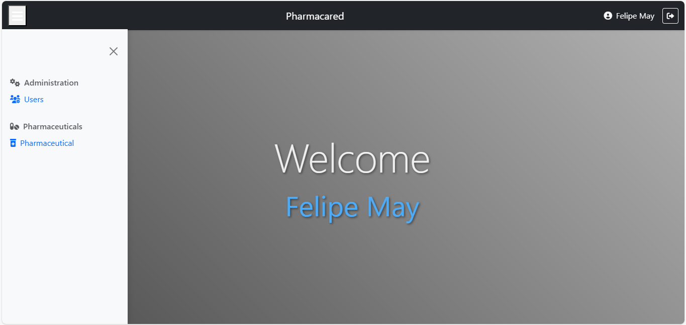
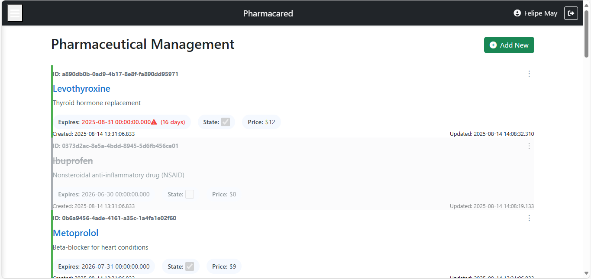
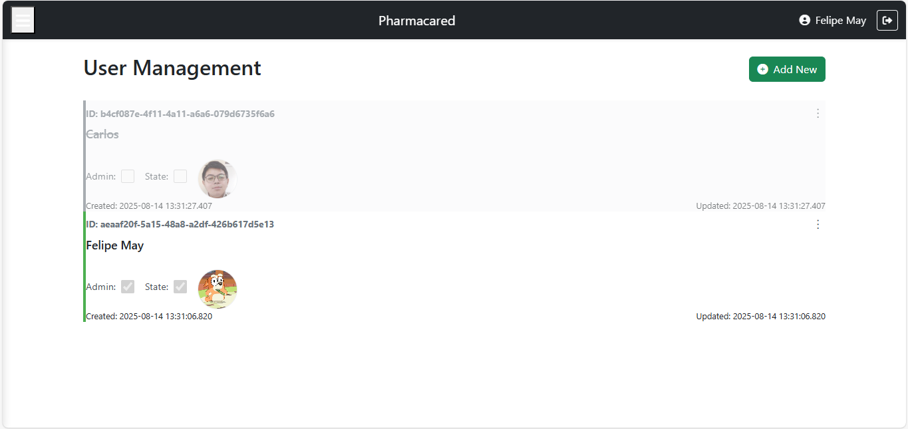

# Phamacared

A comprehensive web-based system for managing purchases and time capture. Built with SQL Server, PHP, and Apache.

## Features ✨

- **User Authentication & Authorization**
	- Role-based access control (Admin)
	- Secure password hashing
	- Session management

- **Pharmaceutical store** 💰
	- Storage for pharmaceuticals

<div align="center">

	<div style="display: flex; justify-content: space-around; flex-wrap: wrap; margin: 20px 0;">

		<div style="text-align: center; margin: 10px; width: 200px;">

			
			<h3>Dashboard</h3> <p>Overview of key metrics and quick access to features</p>

		</div>

		<div style="text-align: center; margin: 10px; width: 200px;">

			
			<h3>Pharmaceutical Management</h3> <p>Inventory tracking and expiration monitoring</p>

		</div>

		<div style="text-align: center; margin: 10px; width: 200px;">

		
		<h3>User Management</h3> <p>Role-based access control and authentication</p>

		</div>

	</div>

</div>

## Tech Stack 🛠️

<div align="center">

	<a href="https://www.php.net">

		

	</a>

	<a href="https://www.microsoft.com/en-us/sql-server">

		

	</a>

	<a href="https://httpd.apache.org">

		

	</a>

	<a href="https://getbootstrap.com">

		

	</a>

	<a href="https://developer.mozilla.org/en-US/docs/Web/HTML">

		

	</a>

	<a href="https://developer.mozilla.org/en-US/docs/Web/CSS">

		

	</a>

</div>

- **Backend**: PHP 8.4.7
- **Database**: SQL Server 16.0.1000.6 (X64)
- **Web Server**: Apache/2.4.65
- **Frontend**: Bootstrap 5, HTML5, CSS3

## Installation 💻

### Prerequisites

```bash
# Clone repository
git clone https://github.com/MaySalguedo/Pharmacared.git
cd Pharmacared